# Assembly

### Inventory
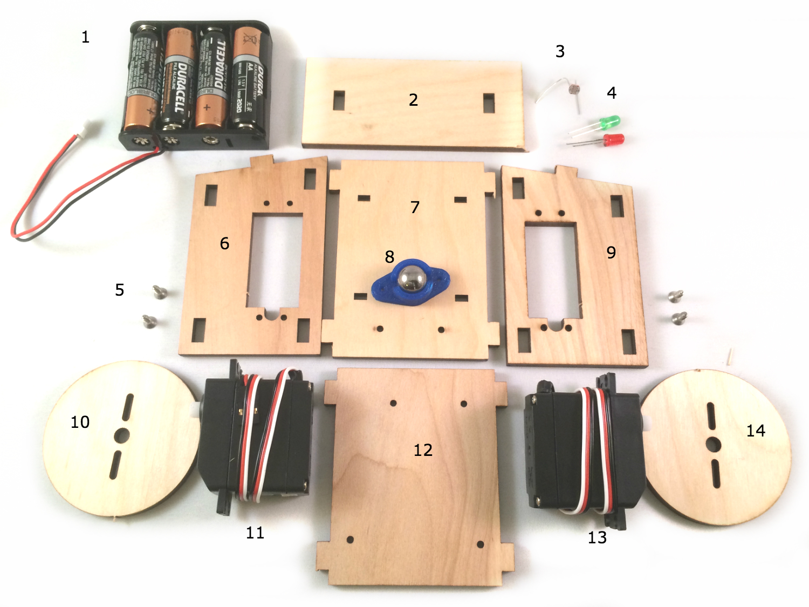

1. Battery box with 4 AA batteries. A single AA battery provides a 1.5V source, delivered at 700mA; when connected in series, 4 AA batteries provide 6V, delivered at 700mA. The Particle Photon will regulate to 3.3V. The servos included in the kit operate at 6V.
2. Front panel
3. Photoresistor, or light sensor. This can be sourced from the ARDX Kit and will be used in a later customization of the bot.
4. LEDs: one green and one red. These are sourced from the ARDX Kit and will be used in a later customization of the bot.
5. Screws; the kit provides 6 and the build will use 2 on each side to secure the servo to the body. The remaining 2 will be used in the Arduino Uno build to fasten the board to the solderless breadboard for that build.
6. Left panel
7. Bottom panel
8. Ball caster; used in this build as the “back wheel” to support the rear of the bot.
9. Right panel
10. Left wheel
11. Left servo
12. Top panel
13. Right servo
14. Right wheel

### Preparation
Before proceeding to the assembly step, there are three major preparatory tasks that must be completed. Consider the project blocked until these tasks are complete.

1. Start a project directory: `mkdir <directory name>`

2. Install Node.js modules from npm.

```js
npm init // follow the wizard to create the package.json file
npm install johnny-five particle-io

```

3. Calibrate the Continuous Servos.

Missing or skipping this step is a direct path to failure.

When a continuous servo’s idle pulse is not calibrated to the available PWM range of the controller board, its behavior will be erratic and uncontrollable. Calibration is simple: send the known idle pulse to the servo and adjust the built-in potentiometer until the servo horn comes to a complete stop. If the servo is not moving when the idle pulse is written to the servo, then it’s safe to assume that the servo is already calibrated. To confirm, adjust the built-in potentiometer in clock-wise and counter clock-wise directions; the horn should respond by turning in the corresponding direction.

To calibrate the servos that came with the SumoBot kit, we will create a new file called calibrate.js

`touch calibrate.js`

This file will containing the program for the controller board you’re setting up below. The purpose of the program is to connect to the board, initialize a continuous servo instance with the Servo.Continuous class and immediately call the instance’s stop method (which will send the idle pulse to the servo)

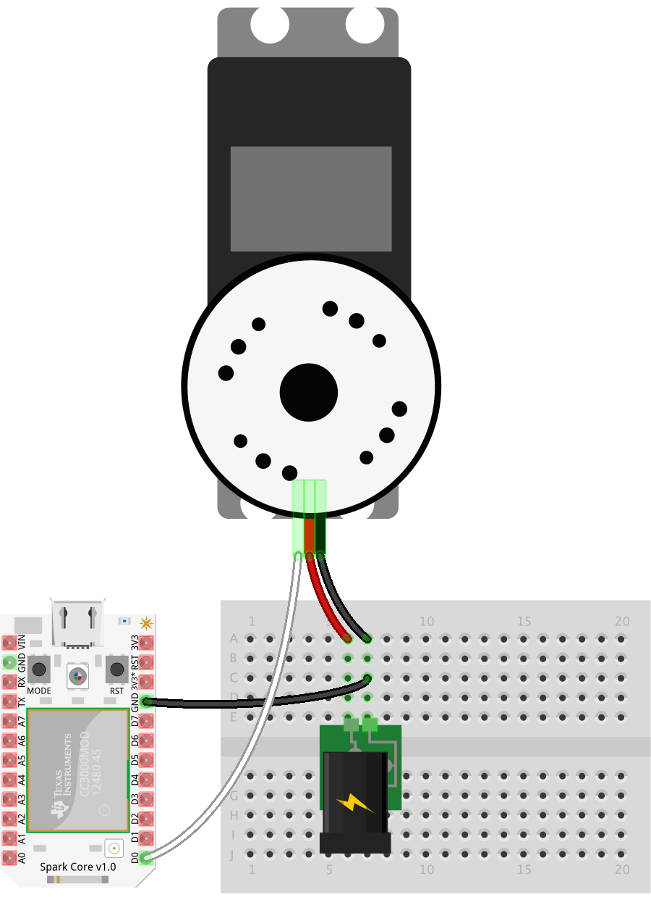

```
// calibrate.js
var five = require("johnny-five");
var Particle = require("particle-io");
var board = new five.Board({
  io: new Particle({
    token: "token", // put your token here
    deviceId: "device id" // get the id of your device with particle list
  })
});
board.on("ready", function() {
  new five.Servo.Continuous("D0").stop();
});
```
Run the program with the following:

`node calibrate.js`

While running, adjust the servo’s potentiometer until it comes to a complete stop. This video shows the operation in action:

<video controls="" class="blog-full-width-block" style="display: inline-block;width: 100%;margin: 0 0 1em 0;">
  <source src="https://dl.dropboxusercontent.com/u/3531958/sumobot/continuous-calibration.mp4">
  <source src="https://dl.dropboxusercontent.com/u/3531958/sumobot/continuous-calibration.webm">  
  <source src="https://dl.dropboxusercontent.com/u/3531958/sumobot/continuous-calibration.ogv">
  <iframe width="420" height="315" src="//www.youtube.com/embed/EeJwDsEuSdI" frameborder="0" allowfullscreen=""></iframe>
</video>

### Assembly
The SumoBot Kit includes an insert that provides a numbered and illustrated assembly guide; while the guide is adequate, this build is different enough to warrant its own set of instructions.

1. For each side panel, line up a servo so that the horn is closest to the front of that panel. The end of the servo with the wiring harness must be opposite of the cut out notch in the panel that would logically be used to thread the wiring through (which is facing to the back of the bot), but this build ignores that logic ;)
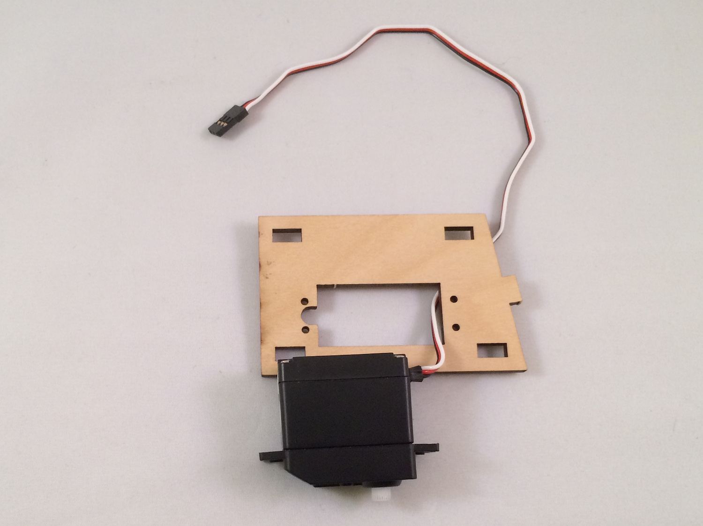

2. Push the servo through the mounting cut-out and line up its mounting tabs with the through holes in the side panel.
<video controls="" class="blog-full-width-block" style="display: inline-block;width: 100%;margin: 0 0 1em 0;">
  <source src="https://dl.dropboxusercontent.com/u/3531958/sumobot/sumo-servo-assembly.mp4">
  <source src="https://dl.dropboxusercontent.com/u/3531958/sumobot/sumo-servo-assembly.webm">  
  <source src="https://dl.dropboxusercontent.com/u/3531958/sumobot/sumo-servo-assembly.ogv">
  <iframe width="420" height="315" src="//www.youtube.com/embed/OVeDhGpFzfI" frameborder="0" allowfullscreen=""></iframe>
</video>

3. This is what correctly assembled right and left panels look like:
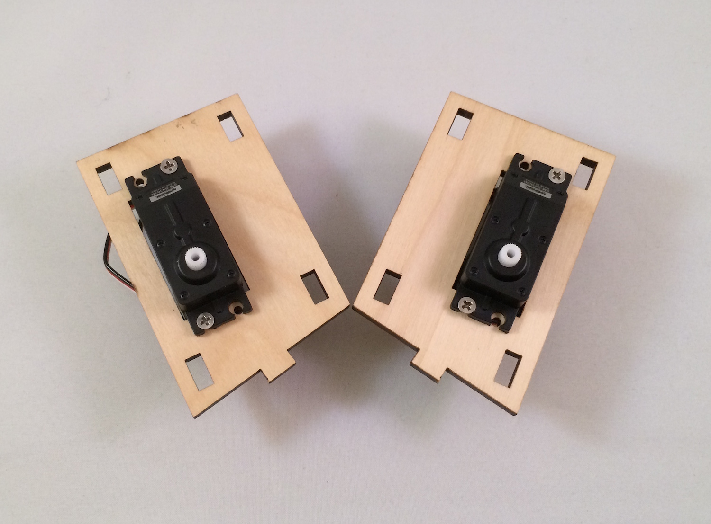

4. Lay out the (clockwise) bottom, right, top and left panels as shown here:
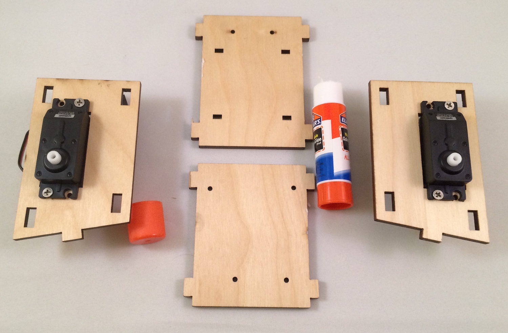

5. Using a bit of glue at each seam, combine the panels so that they match the following. (Note that the ball caster screws should be in the rear of the assembled bot.)
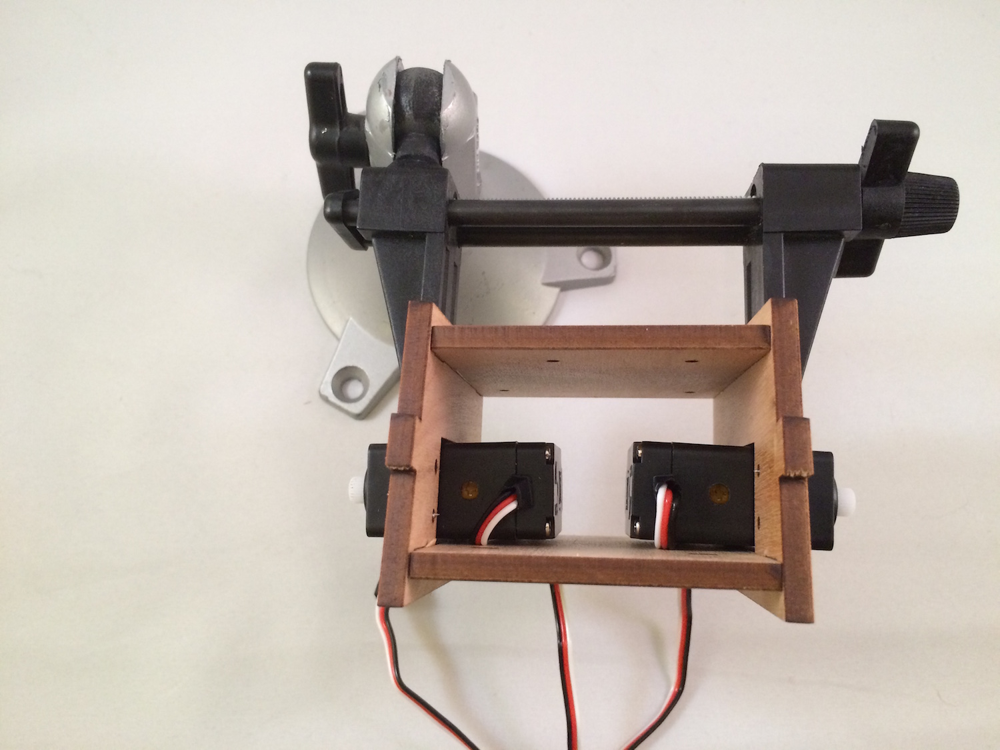
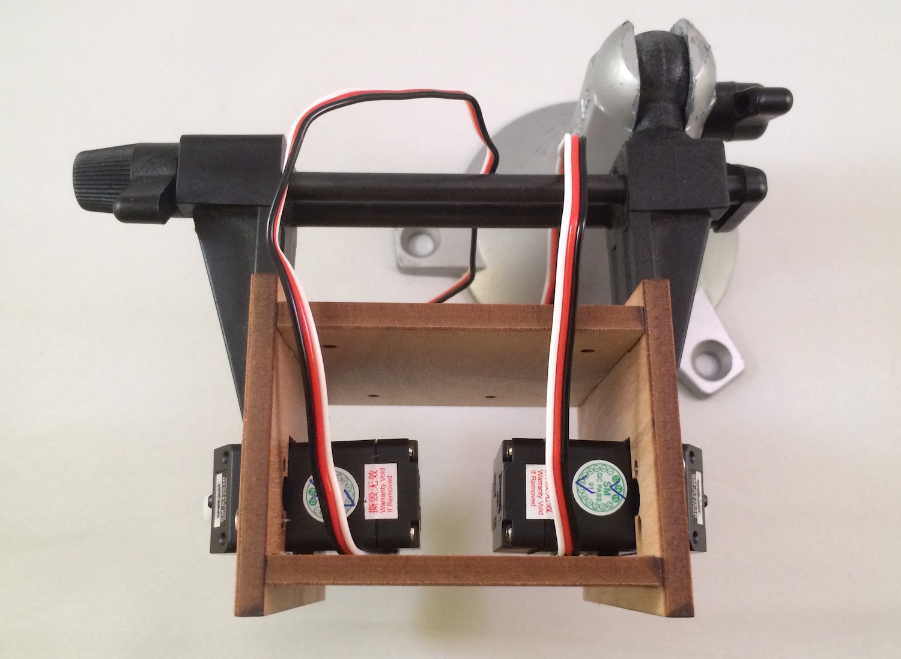

6. Using adequate force, push the wheels onto the servo horns. Notice that the wheels are notched to match the servo horn.
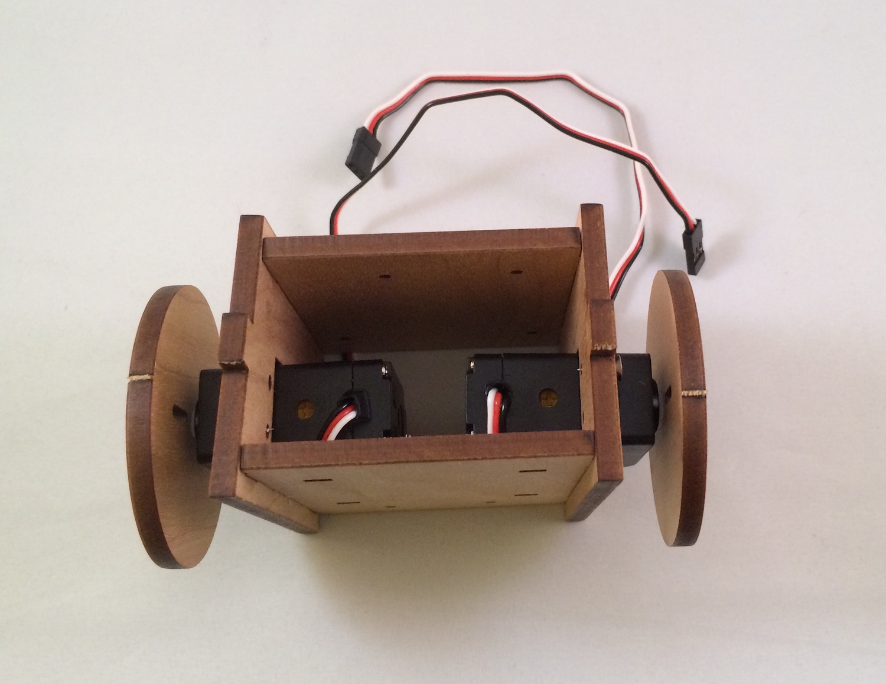


7. With two screws from one of the servo accessory bags, screw the ballcaster into the bottom panel:
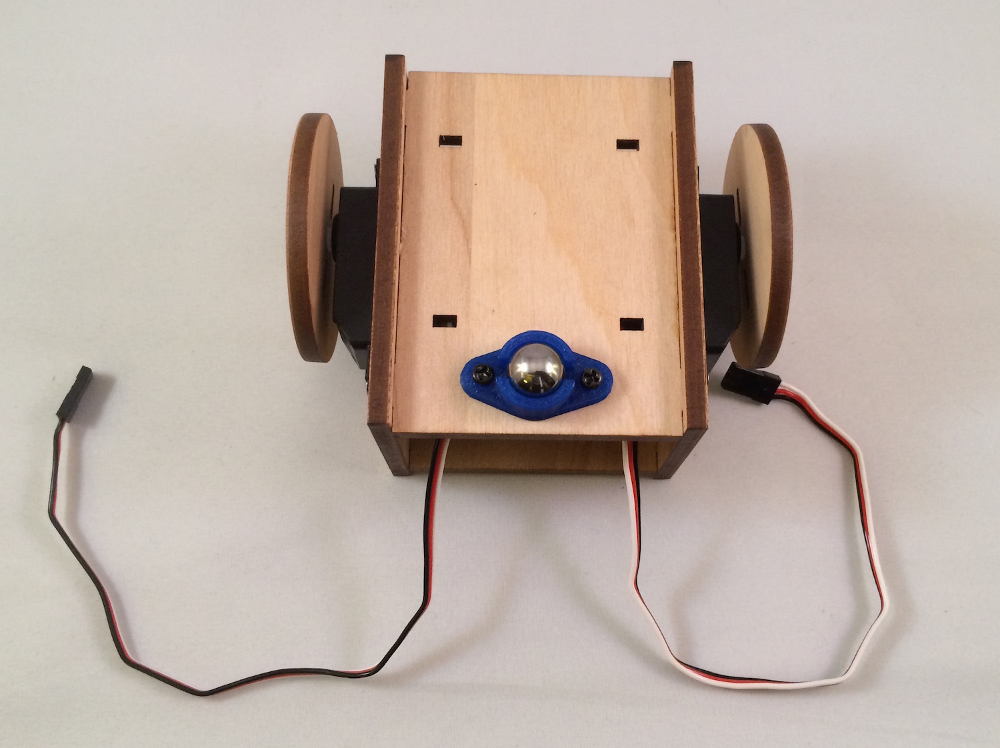

8. Remove the adhesive backing from the solderless breadboard and attach it directly to the top of the bot:
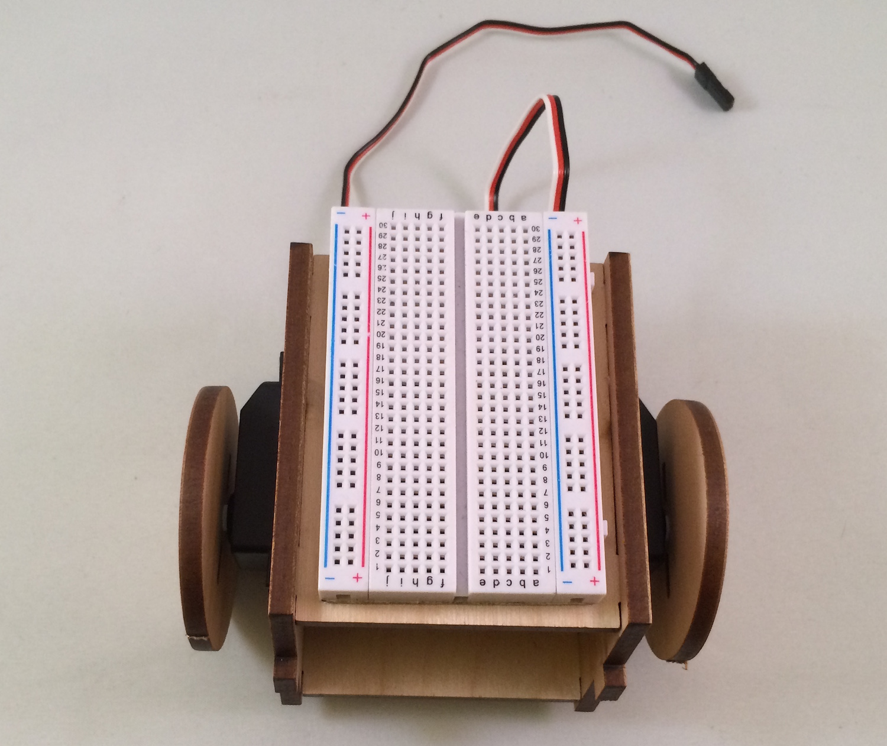

9. Attach the front panel to the bot (glue is optional, as you may want to customize this later).
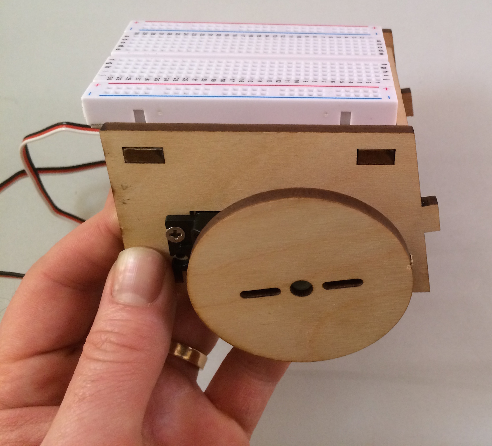

10. Enjoy your assembled robot!
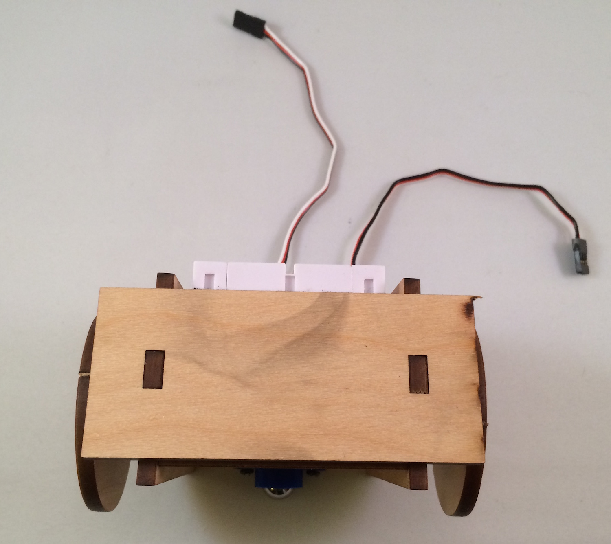

These instructions are adapted from [Assembling and Preparing the RobotsConf Sumobot with Johnny-Five](https://bocoup.com/weblog/assembling-preparing-robotsconf-sumobot-with-johnny-five/) by [Rick Waldron, creator of Johnny Five](https://twitter.com/rwaldron)
